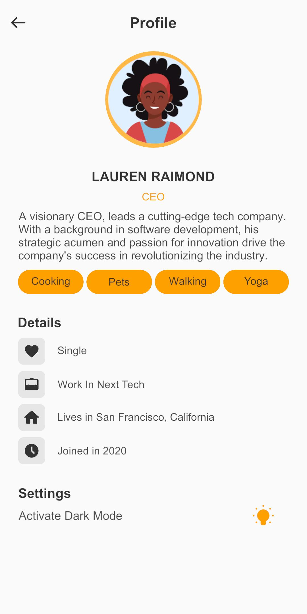
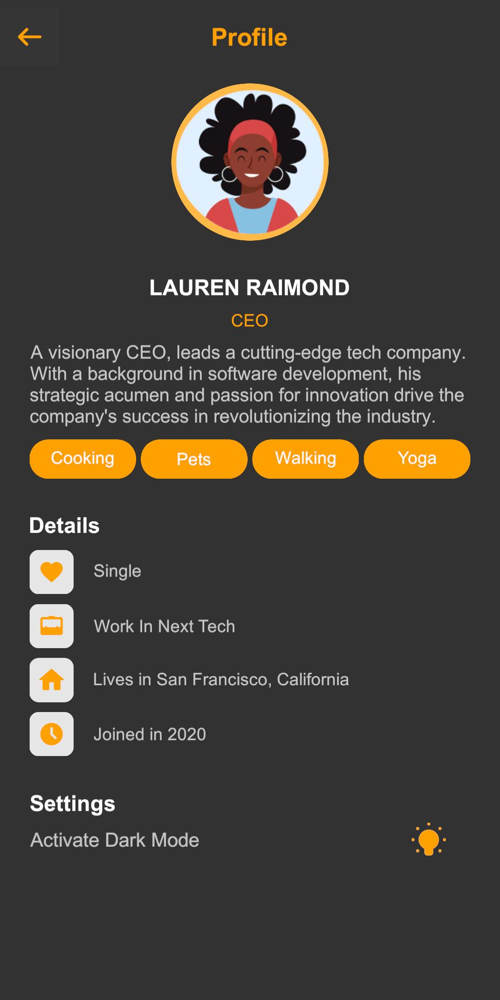

<h1 align="center">

 
ColorApp
</h1>

Forum Thread: https://forum.unity.com/threads/color-app-plugin-open-source.1557404/

## What is ColorApp
Custom editor tool for Unity that lets you create and edit color palettes and apply them to graphics in your project.

Each color in a palette has two variants (Light/Dark by default, renamable per palette), so a single palette can hold both your normal and dark appearance instead of needing two.

## Getting Started
Open the palette editor from **Window/ColorApp/ColorAppEditor**. If your project has no palette library yet, the window offers to create one — start from the built-in sample palette or an empty one, or migrate assets from ColorApp 1.x if you already have some.

## Creating color palettes
A `ColorPaletteLibrary` asset holds every palette in your project. Each palette is independent: it defines its own set of colors (no shared label list to keep in sync across palettes). For each color you set:
* A **key** — its identifier, e.g. `main_color` or `background`.
* A **Primary** and a **Secondary** value — typically Light and Dark, but each palette can rename its two variants.

Use the **+** / **-** buttons to add or remove palettes, and **Anadir color** / **Quitar ultimo** to manage a palette's colors. Changes apply immediately; there is no separate load/save step.

## Assigning Color Palettes
* Add a **ColorizerHandler** to a GameObject in your scene. It selects which palette is active for that scene (and, optionally, a `ColorPaletteLibrary` to use, so a build doesn't need the asset in a `Resources` folder).
* Add one of the **Colorizer** components (`ColorizerCanvas`, `ColorizerSpriteRenderer`, `ColorizerRenderer`) to a Canvas graphic, Sprite Renderer, or 3D renderer, and pick which color index it should use.
* A Colorizer can also **override** its color directly, with its own Primary/Secondary pair, instead of following the palette.
* Call `ColorizerHandler.ColorizerAll()` — from its inspector button, or from your own code at runtime — to recolor everything at once. Toggling `ColorizerHandler.ActiveVariant` (Primary/Secondary) switches every Colorizer in the scene between the two variants, e.g. for a light/dark mode switch.

## Upgrading from 1.x
ColorApp 2.0 changes the palette format (see [CHANGELOG.md](./CHANGELOG.md)). Your existing `ColorPaletteSetup`/`ColorAppData` assets keep working and are never modified automatically — open **Window/ColorApp/ColorAppEditor** and use **Migrar assets antiguos** to convert them into a `ColorPaletteLibrary`. Colorizer components keep pointing at the same color index, so scenes and prefabs don't need to be touched.

## Support and Contact
For further assistance or inquiries, please contact our support team at jairoandrety@hotmail.com

## Examples

  
  

